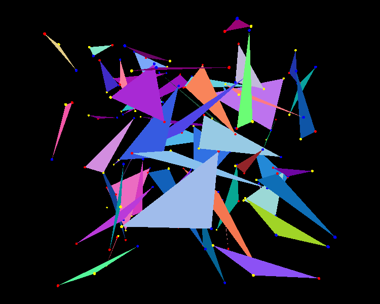
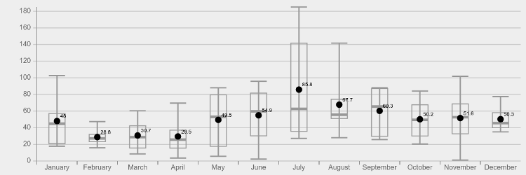

tripartite.js
=============

### Tripartite matching of points in space ###

[Try the simulation](http://daign.github.com/tripartite.js/)

Includes a script for drawing box plots.

[View source](https://github.com/daign/tripartite.js/js/triplot/triplot.js) — [Example demo](http://daign.github.com/tripartite.js/js/triplot/example.html) — [View example source](https://github.com/daign/tripartite.js/js/triplot/example.html)

Licensed under [MIT License](https://github.com/daign/tripartite.js/blob/master/LICENSE)

Dependencies:
* [three.js](https://github.com/mrdoob/three.js)

